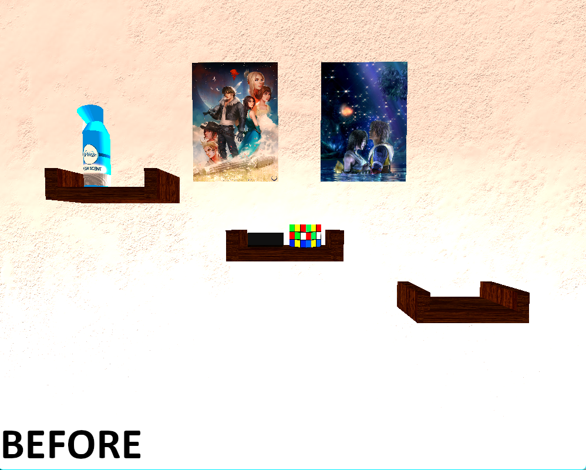
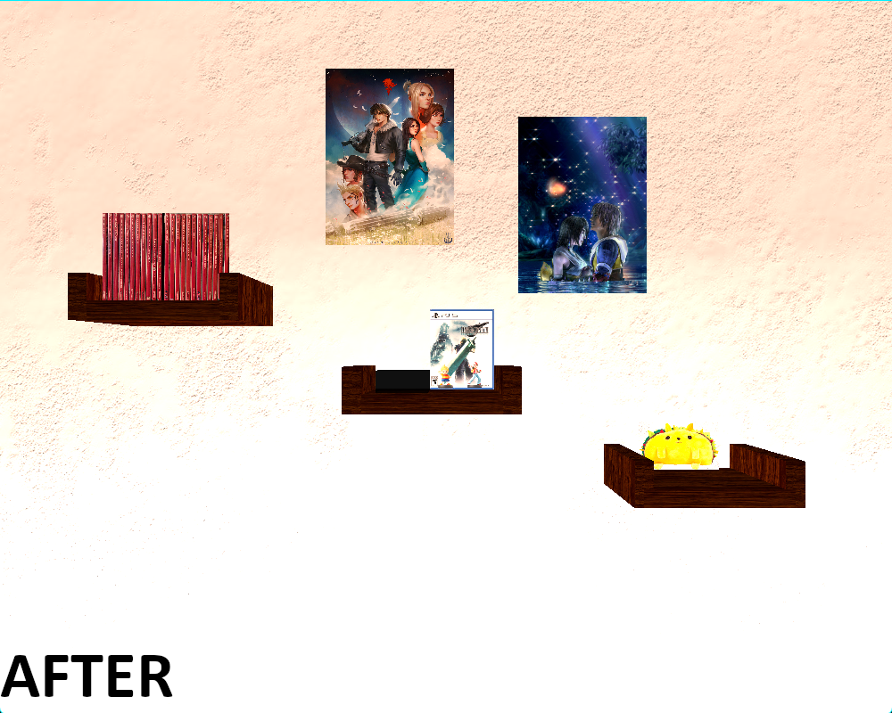
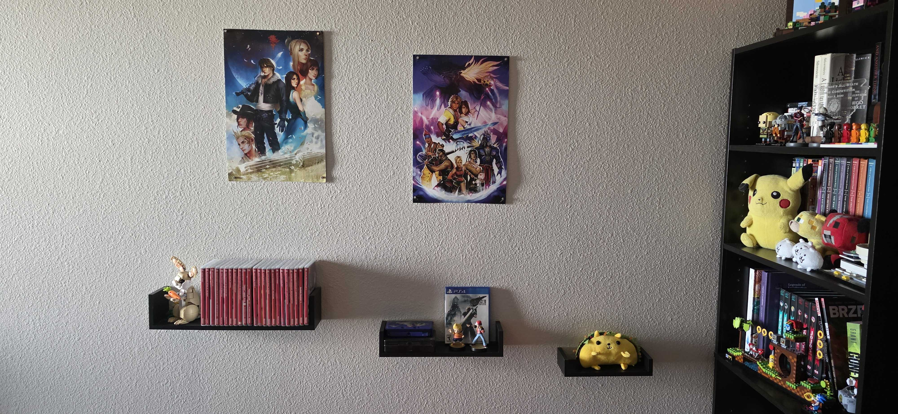
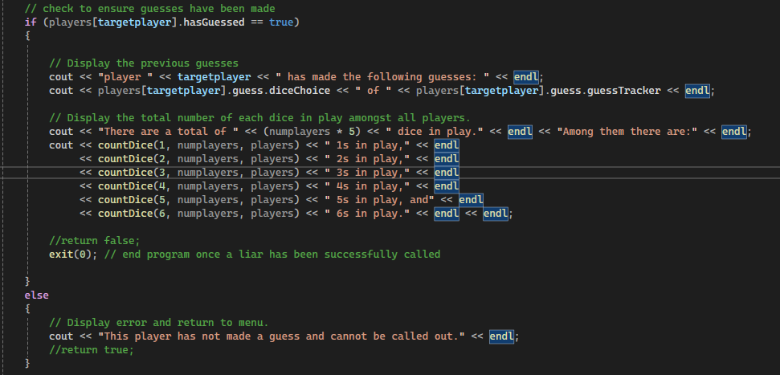
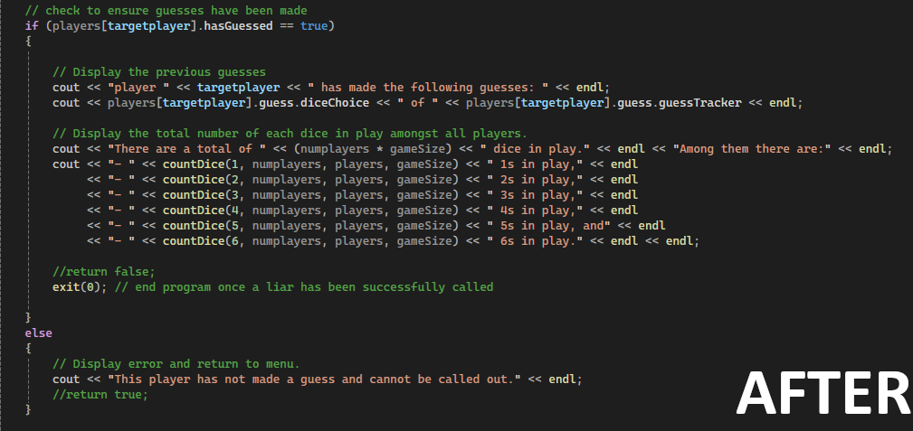
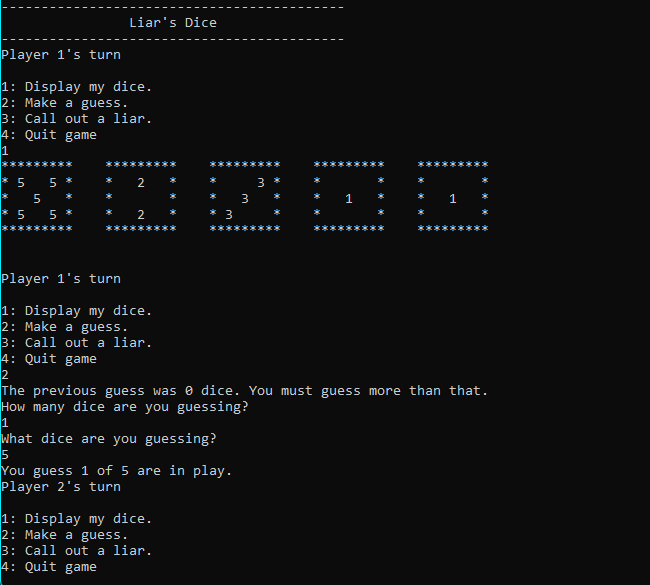
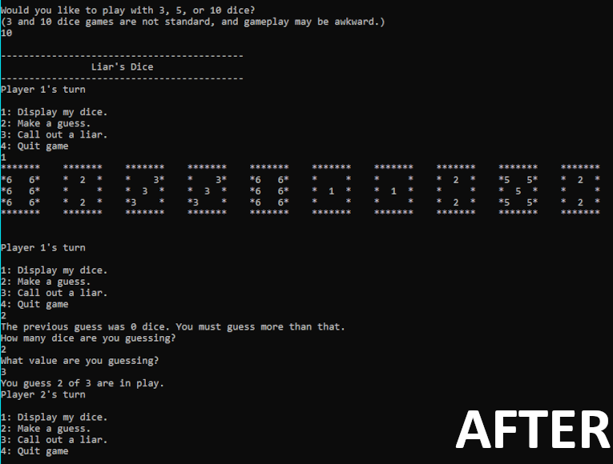

# //Professional Self Assessment

[[Finish self-assessment]]

### //Professional Skills

The following are a selection of hard and soft skills I learned and enhanced while participating in the SNHU Computer Science program.

| Hard Skills | Soft Skills |
| ------------- | ------------- |
| Operating systems | Collaberation |
| Mobile App Development | Problem Solving |
| Software Engineering | Ethics |
| Agile Development | Leadership |
| Database management | Desire to Learn |

Additionally, the following are a selection of languages and APIs I used throughout the program, that I feel sufficiently skilled in.

<table> 
  <tr>
    <td>Java</td>
    <td>Javascript</td>
    <td>Python</td>
  </tr>
  <tr>
    <td>C++</td>
    <td>MongoDB</td>
    <td>OpenGL</td>
  </tr>
</table>

## //Artifact 1: Software Design & Engineering

> The artifact is a recreation of a real world wall in my bedroom, created using C++ OpenGL. It was created as the final project for CS330 Computer Graphics and Visualization. It was created when I was taking CS330 (in 2024).
>
> I selected this item because it was a project I remember enjoying working on, while also remembering how challenging I found it due to my mixed understanding of OpenGL at the time.
> By revisiting the artifact, and enhancing and updating it I feel like I was able to better display my understanding of OpenGL.

> -Exerpt from CS 499 Milestone Two Narrative

For my first artifact, I chose to use the final project from CS330 Computer Graphics and Visualization. This project required us to take a pre-existing and unfinished C++-based OpenGL renderer that we spent the majority of the term updating and developing in minor parts, and using it to recreate a scene of our choice. 
I chose to recreate a scene of my bedroom wall, which contained 3 shelves, 2 posters, and various personal items such as figures, video games, etc.

### //Artifact Comparison

As stated in the brief, the actual changes to the behind the scenes code were extremely minimal at best. The closest thing I did to actually improving the renderer was updating existing textures so that they could load faster, and removing calls to unused textures. The majority of the changes I made were to the scene itself, to better reflect both the wall that it's a recreation of, as well as improve my familiarity with OpenGL.

 

Shown above is a before/after of the scene, fully rendered using Visual Studio 2024, as well as the current state of the wall the scenes recreate as of December 8, 2025. As you can see, some textures such as the posters were moved around to better reflect how they're displayed (even if the incorrect Final Fantasy X poster is still being used in the final scene), and various elements such as the Nintendo Switch game display were moved to be more accurate. Additionally, I added a texture dipicting my copy of Final Fantasy 7 Remake for the PS4 with my Lucas and Pokemon Trainer figures imposed on top of it, to imitate how they're displayed in real life. The only element to not be recreated in OpenGL is the lego rabbit, entirely due to how complex and time-consuming it would be to fully recreate the lego model within the limitations of the engine. If given more time, I would have given it a shot.

## //Artifact 2: Algorithms & Data Structure

> The artifact is a recreation of the real world dice game, Liar’s Dice, created in C++. It was my final project for class IT312.
>
> I selected this item because it was a bit of a disaster project. Originally, I was going to recreate Farkle..., but I struggled over the entire duration of the term making the program work. As a result..., I had to change gears and recreate a much simpler game if I still wanted to meet the course deadline. ...The entire program was rather
> rushed and featured a lot of poorly commented/documented code and used far too many hardcoded and arbitrary values in its math.

> -Exerpt from CS 499 Milestone Three Narrative

My second artifact is an original program where I recreated a physical dice game using Visual Studio. As stated in the narrative exerpt, the original project had to be shelved pretty late in the term, and restarted with a much simpler idea. Liars Dice is a dice game where players take turns guessing how many dice of a specific value are on the board, 
with the game ending if a player is successfully called out as a liar. The original build of the program focused entirely on recreating the gameplay loop of the dice game as closely as possible. The original intent wasn't to create a modular or updatable program, simple one that works. When enhancing the artifact, I took the time to change a lot
of the math and functions in the game, in order to make the code more modular. To take advantage of this, I added two different game modes to allow players to play with 3, 5, or 10 dice instead of forcing a 5 dice game.

### //Artifact Comparison

As stated in the artifact brief, the biggest issue I had with the original program was its lack of modularity and overuse of hardcoded values in its math. As a hobbiest game developer, I do understand that sometimes it's necessary to make use of hardcoded and arbitrary numbers in math, however because my planned enhancement for the program involved expanding it to
support other gamemodes (in this case, 3 and 10 dice games), the hardcoded math needed to be replaced with more modular math. The following example shows one such case of hardcoded numbers in game logic. In this case, in the function that is called to end the game once a player is called as a liar. Originally, as the game only needed to account for 5 dice per player, 'numplayers * 5' worked perfectly fine to count the number of dice in play.

Unfortunately, this simply would not work when trying to run games with varing amounts of dice, as the game would still try and count 5 dice per player which would result in incorrect values being displayed. This was solved by introducing a variable, 'gameSize' which is used throughout the program in place of a hardcoded 5.

As shown here, the variable 'gameSize' is used, which allows the program to account for a variable number of dice per player, rather than exactly 5. This made it possible to run games with 3, 10, and potentially even more dice, should I have chosen to implement the ability to do so!

Updating the internal logic wasn't the only thing I did when updating the program. One change I made was to the dice display, condensing it in order to allow more than 5 dice to be on a single line at once.

The updated display does result in the game feeling more cluttered, even when there are less dice in play, however I feel like it was a necessary sacrifice to make in order for all dice to be displayed at once without an excessively long console.

The biggest issue still standing with the program in its current state is the limitation of how dice are stored in memory. As it currently stands, the game creates a 10 long int array within each player object, which is then filled with random dice values between 1 and 6. This limitation is a result of how the program
was originally developed, and changing it to be more dynamic (such as allowing players to input their own number of dice per game) would likely require a complete rewrite from the ground up. If I were to redo this program from scratch, that is something I would keep in mind from the start to allow for more
dynamic gameplay.

## //Artifact 3: Databases

> Unfortunately, due to circumstances beyond my control (Namely a poorly timed hard drive failure), I do not have access to any of my database related work from during my time in the program. To still have something to show, I instead chose to create a simple day-planner app using MongoDB API and Python to display my knowlege of both. Hopefully, despite not having an
> "original, pre-enhancement" database artifact, this still proves to be sufficient in displaying my evolution of skills relating to MongoDB and Python.

> -Exerpt from CS 499 Milestone Four Narrative

lol

lmao
